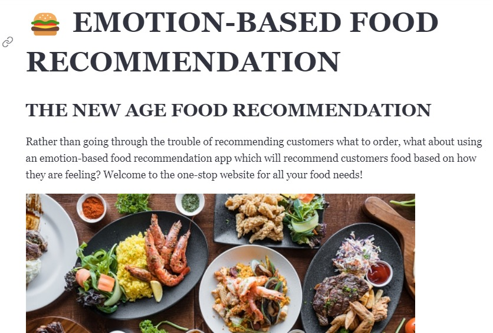
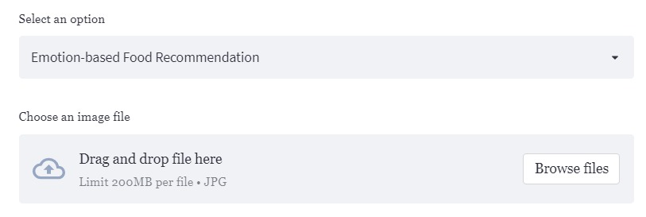
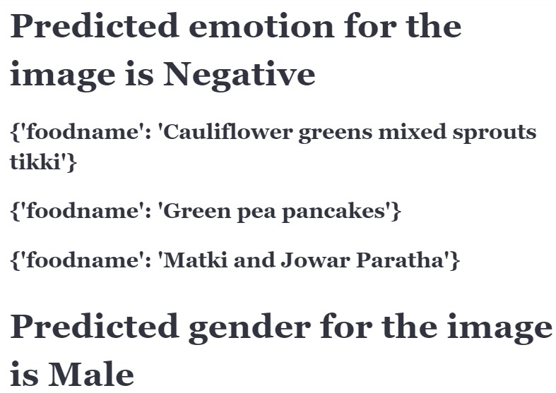

# Reducing Food Wastage using Artificial Intelligence

# Problem
* The food waste problem faced by restaurants in India is a significant issue that contributes to the overall food waste problem in the country. 
* Some factors contributing to food waste in restaurants include over-preparation of food, poor food storage practices, inaccurate forecasting of demand, and cultural norms around serving large portions. 
* This results in a large amount of perfectly good food going to waste, while many people in India are still struggling with food insecurity. 
* This not only has economic consequences but also makes the issue of hunger even worse in the country.

# Solution
Our solution consists of majorly 4 components : 
* Customer Emotion-Based Recommendation System
* Analytics System 
* NGO-Connectivity System
* Restaurant Visitor Forecasting System

User Interface is developed using Streamlit library.
It consists of the following components:
The interface contains 5 sections namely Home, Food, Information, NGO Connectivity and Restaurant visitor Forecasting.

The user has to authenticate to enter the system.
# Authentication System 
The Streamlit-Authenticator library was used for designing it.
* To get access to the interface, we first have to log in using the correct credentials.
* Predefined username-password pairs have been created.
* Hashing of the passwords has been done by using the "bcrypt" algorithm so that any intruders cannot understand the password directly.
* These hashed passwords have been stored in a pickle file using which authentication can be performed.
* In case a person inputs the incorrect credentials, they will be displayed with an error message & will not be allowed access to the interface.

# Sections:

# Home Page
The home page gives an overview of the recommendation system.

#Food
This section consists of Emotion Based Food Recommendation System
From the footage within the restaurant, the emotion along with the age & gender of the customer will be determined by using deep learning models. 
Based on the emotion of the customer, the most suitable food will be recommended for the customer. Many studies have been conducted with respect to what food to recommend based on mood.
If the restaurant owner is able to recommend food that the customer will like efficiently, the owner will know which foods have to be made in more quantity & which in less.
* A .jpg/.png image will be taken as input to the model
* Using CascadeClassifier, we first detect the faces within the image.
* The image of the face will be given as the input to the deep learning model which will output the emotion of the person.
* Once we get the emotion, we fetch the suitable food items from the MYSQL database using the respective queries.
* We display the food item that should be recommended to the customer. The company canteen owner can recommend this food item to the customer.

# NGO Connectivity
* Everyday restaurants throw out a large amount of food, which could rather be donated to an NGO helping many people. 
* In our idea, we are linking the restaurant to the nearest NGO's based on the distance between the NGO & the restaurant. Using Google's Map API, determining this distance in real-time is possible.
* Once the nearest NGO's are determined, we send a "Whatsapp message" automatically asking whether the NGO is willing to accept the food item OR not.
* In case one of the NGO's are not willing to, then we will make the API to find the next nearest NGO, and the process would continue. 

# Information

